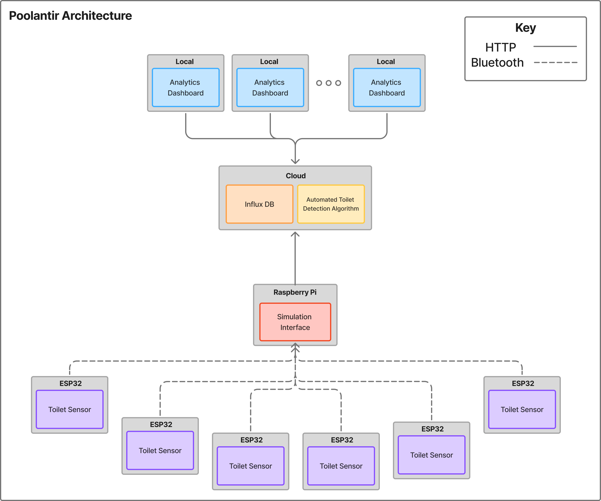
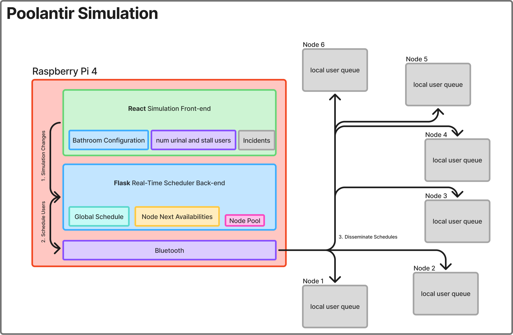
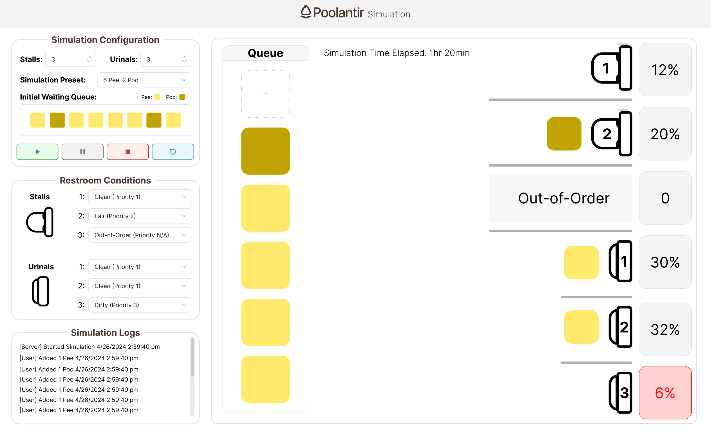
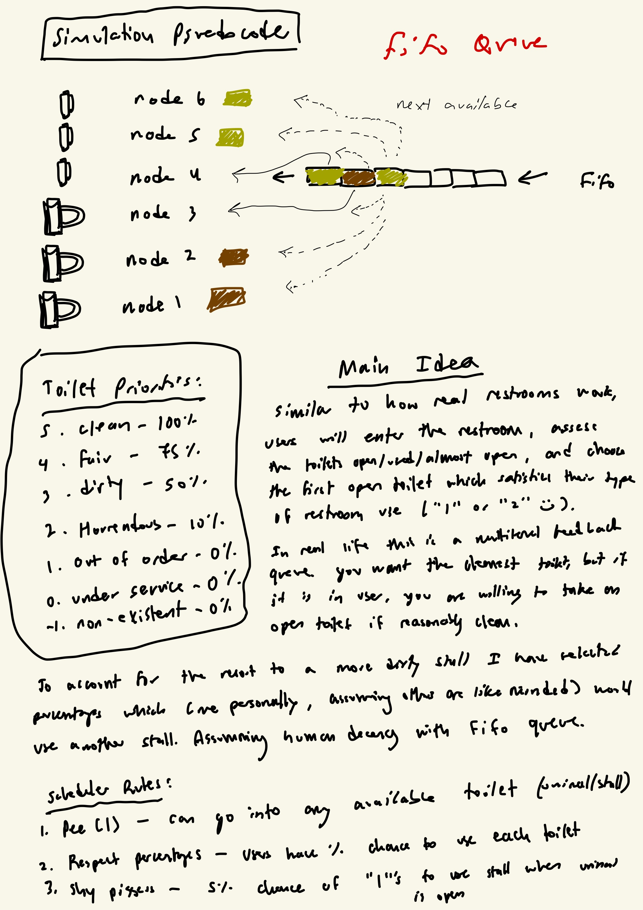
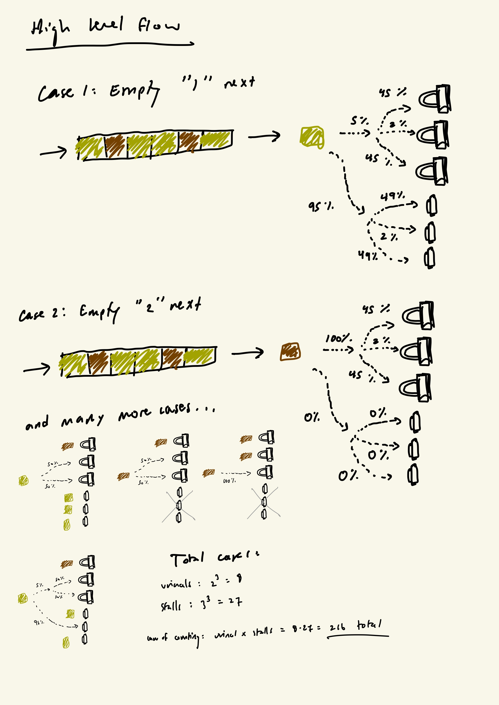

# Poolantir Simulation Interface
Interactive controller for the Poolantir 3D modeled diorama. This is intended to be a sort of human-in-the-loop simulation, requiring a human to configure the state of the bathroom, dispact "users" to the bathroom.
The state of each toilet is dynamically set (clean, fair, dirty, out of order), and scheduled users are placed into 1 of 6 toilets depending on the type of usage and state of the toilet. 

*Cleanliness classifications (priority):*
- 5. clean (100%)
- 4. fair (75%)
- 3. dirty (50%)
- 2. horrendous (10%)
- 1. out-of-order (0%)
- 0. currently being cleaned (0%)
- -1. non-existent (0%) (used for simulating bathrooms with fewer toilets)
These values are configurable within the application interface

In addition to setting the state of the toilet, the user can "clean" the restroom to repair it to the "clean" state. This all happens in real-time

This application allows a user to configure the state of the restroom by setting:

## Poolantir Architecture

  
   
  <em>Poolantir Achitecture</em>

  
   
  <em>Simulation Flow</em>

### React Frontend
Using React to create a single page front-end to control the 3D diorama.

  
   
  <em>Figma Sketch</em>

### Python Backend 
Using a simple flask server for the priority queue toilet scheduler and connection to the Influx database

#### Scheduling Algorithm

  
   
  <em>Poolantir Achitecture</em>

  
   
  <em>Poolantir Achitecture</em>

*Idea:*
Similar to how real restrooms work, users will enter the restroom, assess the toilet state (open/used/almost open/out of order) and choose the first open toilet which satisfies their use type (1: pee, 2: poo :) ).
In real life, this is a FIFO queue (assumming human decency), where the next in line may choose the toilet of their need before following users in the queue. To account for a user resorting to a toilet of less cleanliness, I have factored in some percent chances for a user to select an open toilet given its classification. 

*Rules:*
1. Pee ("1s") - can use either the urinals or stalls
2. Shy pee-ers - this is a small percentage of the population who have peeing anxiety (assuming 2%). These users will elect to use the stalls as their first choice. 
3. Respect assummed percentages - clean (100%), fair (75%), dirty (50%), out-of-order (0%), under service (0%). This is how priority is set.

*Total Cases:*
- urinals: 2^3 = 8 (not in use, pee)
- stalls: 3^3 = 27 (not in use, pee, poo)
_Total = urinals * stalls = 216_

