# Front-End
Front-end should mirror the image in the figma sketch: 

  
   
  <em>Figma sketch</em>

## Core Design Principles:
1. Material UI: use all mui components when applicable (dropdown, textfield, etc). Only use icons when specified.
2. Theme: 
    - Gray: #DFDFDF
    - Dark Brown: #4B382E
    - Light Brown: #C0A300
    - Yellow: #FFE96D
3. Front-end/Backend communication - this application uses Flask. Write all non-ui core logic using python.

## Components
### Header

  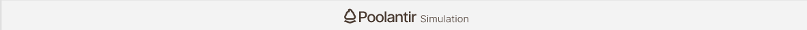
   
  <em>Header component</em>

The header component is simply a 82 height Gray line placed at the top of the screen. Centered in this div is a flexbox containing the poolantir-simulation-logo.svg
There header serves no functionality.

### Sidebar

  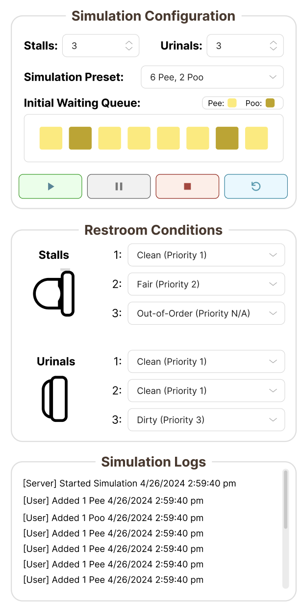
   
  <em>Sidebar component</em>

The sidebar component holds the configuration settings and simulation log for the poolantir simulation. This is a vertical flexbox, containing 3 _sidebar squares_.
1. Simulation Configuration (size: 40%)
2. Restroom Conditions (size: 40%)
3. Simulation Logs (size: 20%, ability to fullscreen logs) 

### Simulation Control Buttons 

  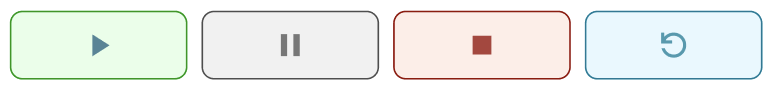
   
  <em>Simulation control buttons</em>

This is a simple flexbox containing 4 actions for the simulation
- start: green (mui start icon)
- pause: gray (mui pause icon)
- stop: red (mui stop icon)
- replay: blue (mui refresh icon)

these each have a slightly darker text and border than their background, and have 8px rounded borders.

### Sidebar Squares

  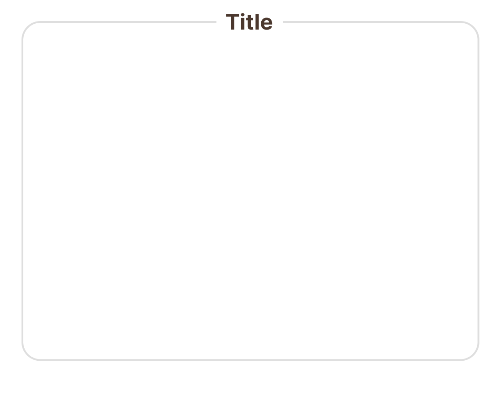
  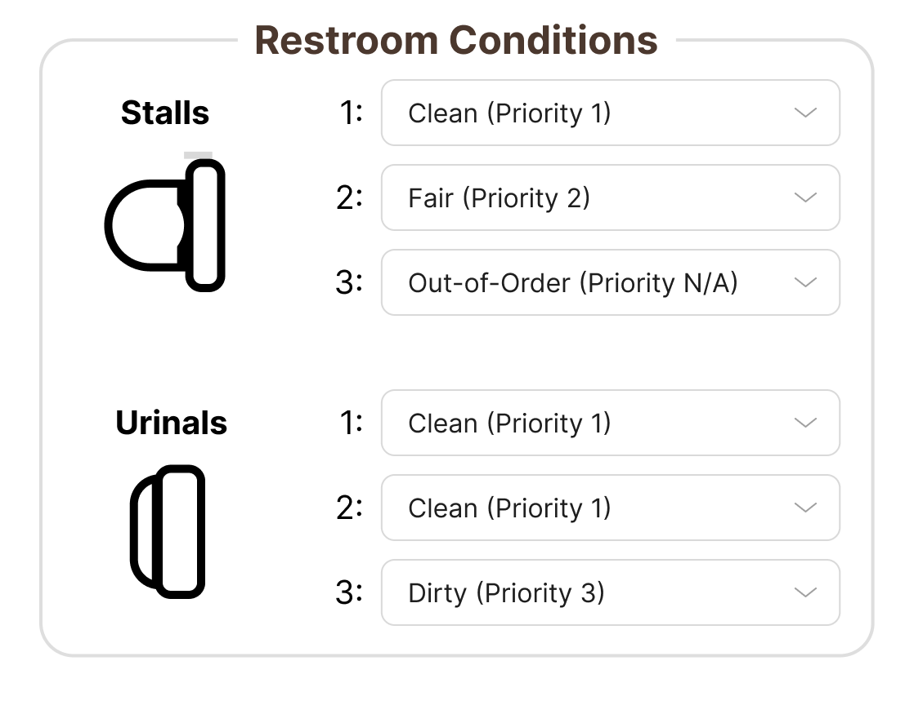
   
  <em>Sidebar square component (left) &nbsp;&nbsp; | &nbsp;&nbsp; Example sidebar square (right)</em>

The sidebar square component is a simple square that encapsulates part of the logic of the simulation. This fits within the larger sidebar component. 
Please note that the "Simulation Configuration" internal contents should be removed. For now, leave this sidebar square blank.

### Queue

  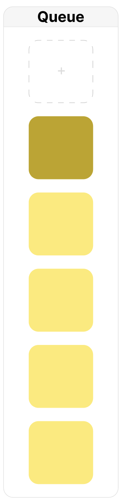
   
  <em>Queue component</em>

The queue compoent has two functionalities:
1. represents the current queue of the restroom
2. allows users to add users (pee/poo) to the queue for processing by the scheduler

### Usage Percentage Square

  
   
  <em>Usage percentage square</em>

simple square that reflects the current usage percentage for the current simulation's run.
- w: 145px
- h: 145px
- background: gray
- all borders rounded 10px

### Stall

  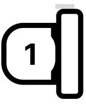
  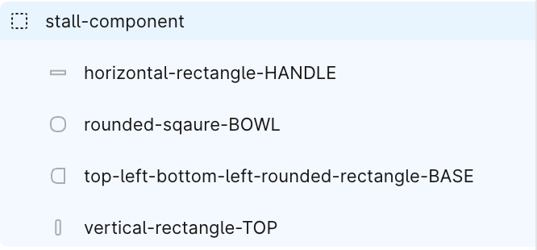
   
  <em>Stall component (left) &nbsp;&nbsp; | &nbsp;&nbsp; Stall component — Figma (right)</em>

The stall is created by using 4 shapes:
1. horizontal-rectangle-HANDLE:
- w: 26px
- h: 6.5px
- background: gray

2. rounded-square-BOWL: 
- w: 66px
- h: 66 px
- background: white
- all corners rounded 25px

3. top-left-bottom-left-rectangle-BASE: 
- w: 75px
- h: 85px
- background: white
- stroke: 7px black
- topleft & bottomleft rounded 30

4. vertical-rectangle-TOP: 
- w: 37px
- h: 123px
- background: white
- stroke: 7px black
- all corners rounded 10px

5. node-id:
- font-size: 24px
- color: black

This can be created with a few flex boxes:
main container: flex-row
- left container: 
    all three components are stacked both horizontally and vertically ontop of eachother:
    - node id
    - rounded-square-BOWL 
    - top-left-bottom-left-rectangle-BASE
- right container:
    - sub-container: flex-column, justify-content: start ,align-items: start
        - horizontal-rectangle-HANDLE
        - vertical-rectangle-TOP

### Stall Container

  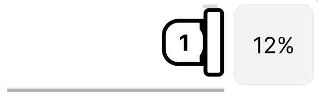
   
  <em>Stall container component</em>

The stall container component can be created as follows:

horizontal flexbox:
    - left: vertical flexbox:
        - stall component
        - horizontal line: 380px
    - right: usage percentage sqaure

this entire component should be 525px wide:
- 380 coming from stall and horizontal line flex box
- 145 coming from the usage percentage square

the component height should be 155:
- 145 for usage percentage square
- 10 padding from bottom for usage percentage square

### Urinal 

  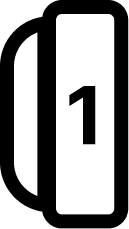
  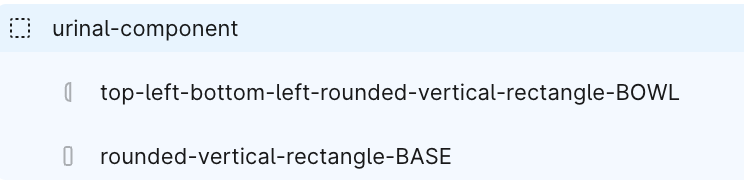
   
  <em>Urinal component (left) &nbsp;&nbsp; | &nbsp;&nbsp; Urinal component — Figma (right)</em>

The urinal component is created using 2 rectangles:
1. top-left-bottom-left-rounded-vertical-rectangle-BOWL:
- w: 26px
- h: 98px
- background: white
- stroke: 7px black
- top left and bottom left corners rounded 25px

2. rounded-vertical-rectangle-BASE:
- w: 43px
- h: 114.22px
- background: white
- stroke: 7px black
- all corners rounded 10px

### Urinal Container

  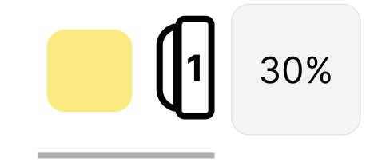
   
  <em>Urinal container component</em>

The urinal container component can be created as follows:

horizontal flexbox:
    - left: vertical flexbox:
        - urinal component
        - horizontal line: 200px
    - right: usage percentage square

this entire component should be 525px wide:
- 380 coming from urinal and horizontal line flex box
- 145 coming from the usage percentage square

the component height should be 155:
- 145 for usage percentage square
- 10 padding from bottom for usage percentage square

### Simulation Elapsed Time

  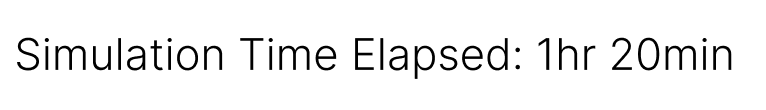
   
  <em>Simulation elapsed time</em>

This is a simple text field that shows the current elapsed time of the simualation
- font-size: 24px
- color: black

### Simulation Digital Twin

  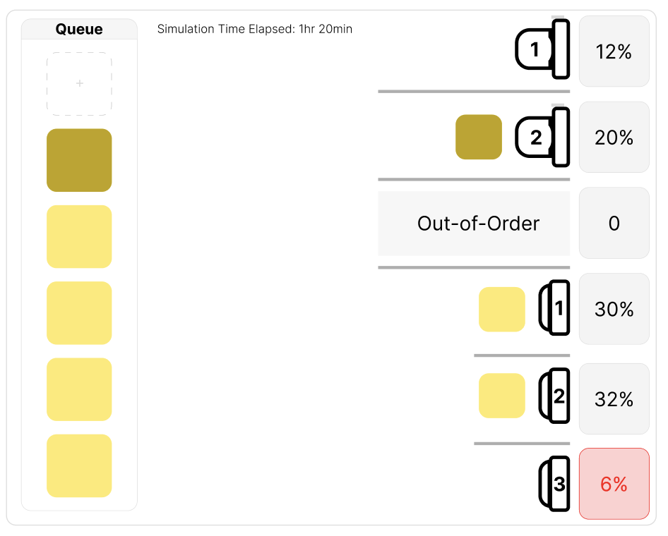
   
  <em>Simulation digital twin</em>

The simulation digital twin is a container that hold:
1. queue (placed at the left start)
2. toilets & percent usage (placed end right)
